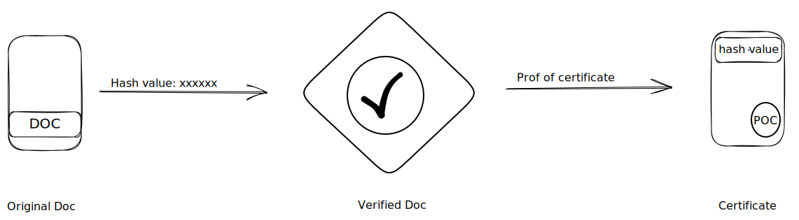

# 📝 bStamp

What exactly stamping in blockchain ?

Blockchain technology has revolutionized the way we store and transfer data. It has enabled us to securely store and transfer data without the need for a third-party intermediary. This is why blockchain-based stamping is becoming increasingly popular.

Stamping with blockchain allows users to securely timestamp documents, contracts, and other digital assets on the blockchain. This ensures that these documents are immutable and can be verified by anyone at any time. It also provides an extra layer of security as it prevents tampering or unauthorized access to the documents.

In addition, stamping with blockchain also helps in reducing costs associated with document storage and verification as it eliminates the need for third-party intermediaries. This makes it an attractive option for businesses looking to reduce their overhead costs while still ensuring secure document storage and verification.

What is the need of stamping with blockchain &#x26; it's working ?

Blockchain-based Time-stamping is the process of recording data on a blockchain to prove that it existed at a specific date and time.

Blockchain-based Time-stamping services are an innovative way for businesses to provide proof of existence for their documents. It is also used by organizations for tracking legal contracts, patents, and other vital records.

A timestamp record is a digital signature of the sender or receiver on a document, which can be verified against **PKI**(Public key infrastructure).

Blockchain based time stamping is a system to verify data and assign a time or date of creation for digital documents or events.\
&#x20;         In the simplest form, the timestamp is a string of characters that uniquely identifies the document or event and indicates when it was created.

Blockchains are decentralized systems that record data in blocks on a ledger. The blocks contain information on transactions between users on the blockchain platform. \
Each block must have a unique identifier. The hash function provides this identifier by converting an input value to an output value with a fixed number of digits or bits.

What bStamp is and how bStamp works ?

Stamping in blockchain refers to the process of permanently recording data onto the blockchain in a way that proves that the data existed at a particular point in time. This is often done through the use of a cryptographic hash function, which takes in the data and produces a fixed-size output that is unique to that specific data.

The process of stamping involves adding the hash of the data to a block, which is then added to the blockchain. Once added, the hash becomes part of the immutable blockchain ledger and serves as proof that the data existed at the time it was stamped. This makes it impossible to alter or delete the data without also changing the hash, which would be detectable and invalidate the proof of existence.

* The user creates or inputs data through his device. The data is hashed using a cryptographic algorithm to create a unique identifier for the data.

<!---->

* The hashed data is then combined with other transaction data to create a block and the block is broadcasted to the blockchain network.
* Nodes on the network validate the block and the data within it using consensus mechanisms, such as Proof of Work (PoW) or Proof of Stake (PoS).
* Once the block is validated, it is added to the blockchain and becomes part of the immutable ledger.
* The hash of the data can now be used as a reference or proof of existence, as it is tied to the specific block and time it was added to the blockchain.


This is how stamping in bStamp works


<strong>edeXa</strong> bStamp pros over other stamping applications .

* They are more **reliable** and **secure**, as they cannot be changed or removed once published to the **ledger**.&#x20;
* Blockchain is decentralized, which minimizes the possibility of **tampering** by any one party.&#x20;
* Timestamps can be viewed entirely transparently if desired.

### 🖖 Become a part of bStamp community

Connect and get the latest updates of bStamp : [bStamp Discord](https://discord.gg/mzqgaUz6)
